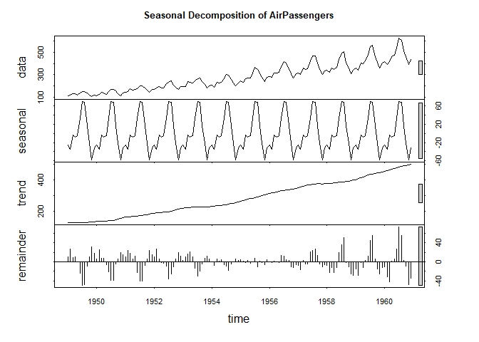
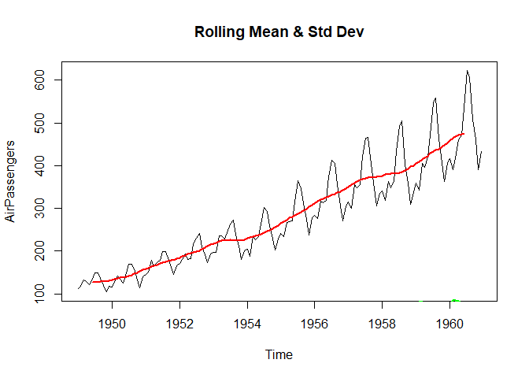
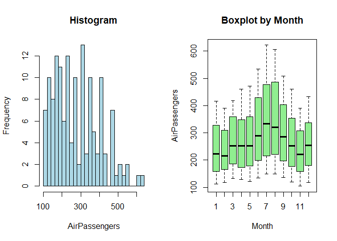
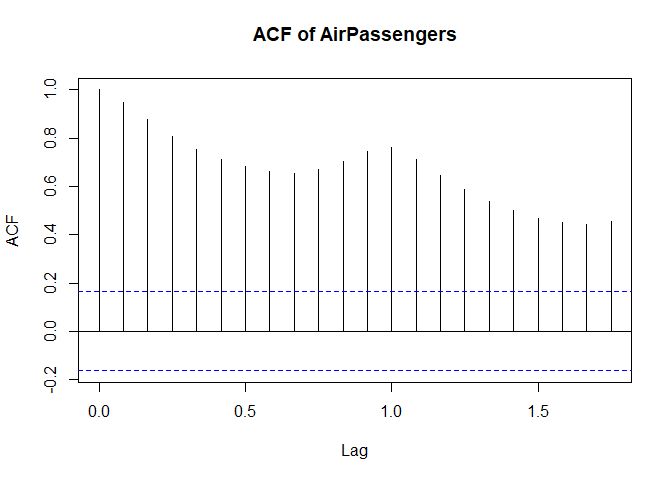
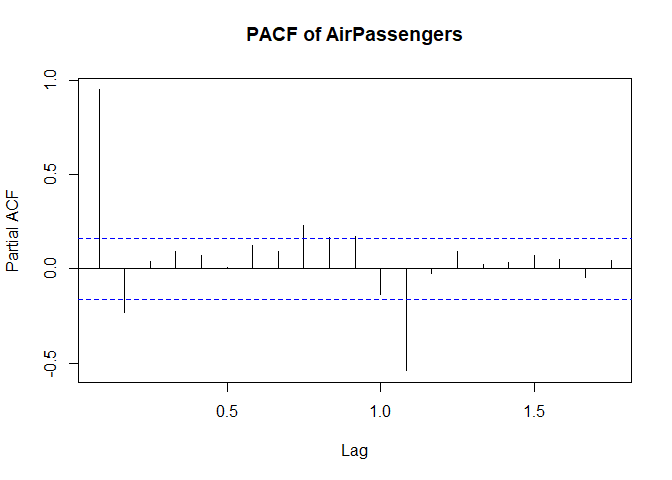
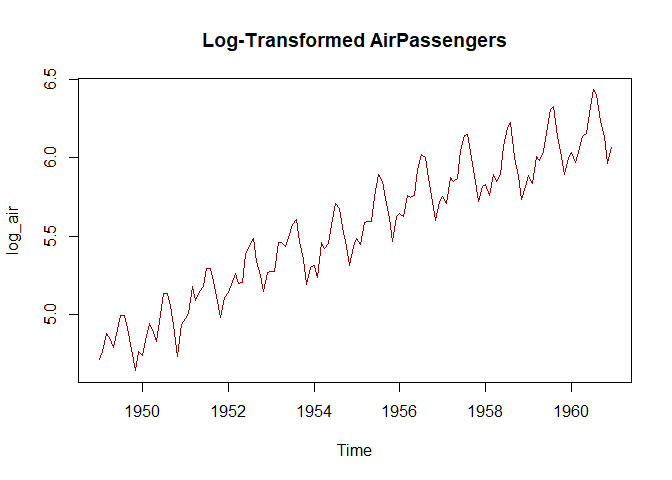
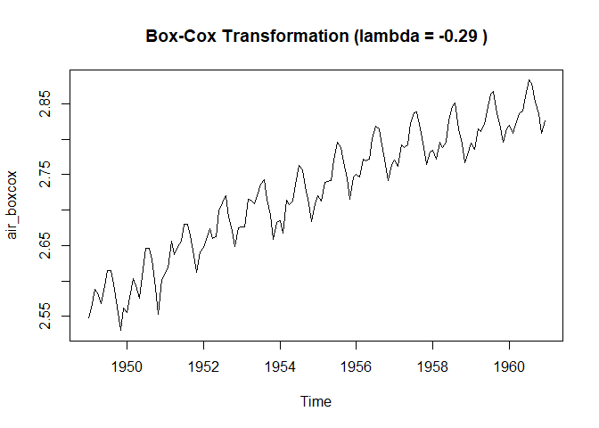

Time Series Analysis - Auto ARIMA
================
Naga Vemprala
2026-03-19

## 1. Introduction to Time Series

A **time series** is a sequence of data points collected or recorded at
specific time intervals (e.g., daily stock prices, monthly rainfall).
The goal of time series analysis is to understand the underlying
patterns—such as trends and seasonality—to predict future values.

### Key Concept: Stationarity

For an ARIMA model to work, the data must be **stationary**. This means
its statistical properties (mean and variance) do not change over time.

- **Trend**: A long-term increase or decrease in the data.
- **Seasonality**: A repeating pattern related to the calendar (e.g.,
  higher sales every December).
- **Variance**: The “spread” of the data; if it grows or shrinks over
  time, the data is non-stationary.

#### Which of these series are stationary?

1.  Google closing stock price in 2015;
2.  Daily change in the Google stock price in 2015;
3.  Annual number of strikes in the US;
4.  Monthly sales of new one-family houses sold in the US;
5.  Annual price of a dozen eggs in the US (constant dollars);
6.  Monthly total of pigs slaughtered in Victoria, Australia;
7.  Annual total of Canadian Lynx furs traded by the Hudson Bay Company;
8.  Quarterly Australian beer production;
9.  Monthly Australian gas production.

<figure>

<figcaption aria-hidden="true">Stationarity</figcaption>
</figure>

Presence of Seasonality, Trend, and increasing or decreasing variance
makes a time series data non-stationary.

Source: Forecasting: Principles and Practice (3rd ed), Rob J Hyndman and
George Athanasopoulos

- ARIMA (Autoregressive integrated moving average) Non-seasonal models
  basically involve the estimation of an autoregressive model and a
  moving average, employed to estimate both the stochastic part and the
  underlying trend.

Refer: [R Cookbook](https://rc2e.com/timeseriesanalysis)

There are other models to handle seasonal data similar to ARIMA.  
SARIMA : Seasonal ARIMA  
SARIMAX : Seasonal ARIMA with exogenous variables

**Some important questions to first consider when first looking at a
time series are:**

- Is there a trend, meaning that, on average, the measurements tend to
  increase (or decrease) over time?  
- Is there seasonality, meaning that there is a regularly repeating
  pattern of highs and lows related to calendar time such as seasons,
  quarters, months, days of the week, and so on?  
- Are there outliers? In regression, outliers are far away from your
  line. With time series data, your outliers are far away from your
  other data.  
- Is there a long-run cycle or period unrelated to seasonality
  factors?  
- Is there constant variance over time, or is the variance
  non-constant?  
- Are there any abrupt changes to either the level of the series or the
  variance?

## Time Series Data:

- zoo and xts are excellent packages for working with time series data  
- They define a data structure for time series, and they contain many
  useful functions for working with time series data.  
- The xts implementation is a superset of zoo, so xts can do everything
  that zoo can do

``` r
library(xts)       # Advanced time series data handling
```

    ## Loading required package: zoo

    ## 
    ## Attaching package: 'zoo'

    ## The following objects are masked from 'package:base':
    ## 
    ##     as.Date, as.Date.numeric

``` r
library(zoo)       # Infrastructure for regular and irregular time series
library(forecast)  # Core package for ARIMA and forecasting
library(tseries)   # Used for stationarity tests (like the ADF test)
```

    ## Registered S3 method overwritten by 'quantmod':
    ##   method            from
    ##   as.zoo.data.frame zoo

``` r
library(quantmod)  # Financial modeling and fetching stock data
```

    ## Loading required package: TTR

``` r
library(ggplot2)   # Advanced data visualization
```

- We use quantmod to fetch real-world data from Yahoo Finance. The xts
  and zoo packages ensure R treats the index as a “Date” rather than
  just a row number.

``` r
stockData <- getSymbols(Symbols = "MSFT", 
                        src = "yahoo",
                        auto.assign = getOption('getSymbols.auto.assign',FALSE),
                        from = as.Date("2024-01-01")
)
```

#### Typical Time Series EDA Steps

1.  **Visual inspection with line plots**  
    Plot the variable against time to see trends, seasonality, cycles,
    and abrupt changes.

2.  **Seasonal decomposition**  
    Use tools like `stl()` or `decompose()` to break the series into
    trend, seasonal, and residual components.

3.  **Check stationarity**

    - Visual check: rolling mean and variance.  
    - Statistical tests: Augmented Dickey-Fuller (ADF) or KPSS test.

4.  **Distribution analysis**  
    Histograms, boxplots (by month/quarter) to understand the overall
    distribution and detect outliers.

5.  **Lagged analysis**

    - **Autocorrelation Function (ACF)** and **Partial Autocorrelation
      Function (PACF)** plots to identify AR/MA orders.  
    - Scatter plots of series vs. its lags.

6.  **Summary statistics by time segments**  
    For example, mean and variance per month or year to spot
    heteroscedasticity or seasonal effects.

7.  **Check for missing values and outliers**  
    Time series often need interpolation or special treatment for gaps.

8.  **Transformations**  
    If variance changes over time, try log or Box‑Cox transformations.

- It is quite easy and simple to plot time series data using base plots
- plot() function is a generic function.

| plot syntax | purpose |
|----|----|
| plot(x, y) | Scatterplot of x and y numeric vectors |
| plot(factor) | Barplot of the factor |
| plot(factor, y) | Boxplot of the numeric vector and the levels of the factor |
| plot(time_series) | Time series plot |
| plot(data_frame) | Correlation plot of all dataframe columns (more than two columns) |
| plot(date, y) | Plots a date-based vector |
| plot(function, lower, upper) | Plot of the function between the lower and maximum value specified |

#### Example code samples

- Time Series decomposed into separate components.

``` r
# Using AirPassengers for decomposition as it has clear seasonality. Use this only as an example to test the stock data. 

# Seasonal Decomposition (Additive or Multiplicative, both are handled well)
decomp <- stl(AirPassengers, s.window = "periodic")
plot(decomp, main = "Seasonal Decomposition of AirPassengers")
```

<!-- -->

- Step 3: **Check stationarity**
- Forecasting is only reliable when data is stationary (consistent mean
  and variance over time).

``` r
# 3a. Visual Check only - Later in the same code cell, running statistical test: Rolling Mean and Variance
library(zoo)
roll_mean <- rollmean(AirPassengers, k = 12, fill = NA)
roll_std <- rollapply(AirPassengers, width = 12, FUN = sd, fill = NA)

plot(AirPassengers, main = "Rolling Mean & Std Dev")
lines(roll_mean, col = "red", lwd = 2)
lines(roll_std, col = "green", lwd = 2)
```

<!-- -->

``` r
# 3b. Statistical Test: Augmented Dickey-Fuller (ADF)
# Null Hypothesis: Data is non-stationary
adf_test <- adf.test(AirPassengers)
print(adf_test)
```

    ## 
    ##  Augmented Dickey-Fuller Test
    ## 
    ## data:  AirPassengers
    ## Dickey-Fuller = -7.3186, Lag order = 5, p-value = 0.01
    ## alternative hypothesis: stationary

- Step 4. **Distribution and Outlier Analysis**
- Histograms and boxplots help detect outliers and understand the price
  spread

``` r
# 4. Distribution Analysis
par(mfrow = c(1, 2))
hist(AirPassengers, breaks = 20, main = "Histogram", col = "lightblue")
boxplot(AirPassengers ~ cycle(AirPassengers), 
        main = "Boxplot by Month", 
        xlab = "Month", col = "lightgreen")
```

<!-- -->

- Step 5. **Lagged and Correlation Analysis**
- ACF and PACF plots are essential for identifying the $p$ (AR) and $q$
  (MA) orders for ARIMA models.

#### What is Auto Correlation?

- Autocorrelation represents the degree of similarity between a given
  time series and a lagged version of itself over successive time
  intervals.  
- Y_t depends on the lags only making the equation:

$$
Y_t = \alpha + \beta_1 Y_{t-1} + \beta_2 Y_{t-2} + ... + \beta_p Y_{t-p} + \epsilon_1 
$$ *Assumption:* errors are independently distributed with a normal
distribution that has mean 0 and constant variance.

<p>

One of the simplest ARIMA type models is a model in which we use a
linear model to predict the value at the present time using the value at
the previous time. This is called an AR(1) model, standing for
autoregressive model of order 1. The order of the model indicates how
many previous times we use to predict the present time.
</p>

#### What is Moving Average part?

Moving averages model is the one where Y_t depends only on the lagged
forecast errors. It is depicted by the following equation:

$$
Y_t = \alpha + \epsilon_t + \phi_1\epsilon_{t-1} + \phi_2\epsilon_{t-2} + ... + \phi_q\epsilon_{t-q}  
$$

The errors (inputs in the MA part) are coming from the errors of AR part
equation. (MA order q) part of (p, d, q)

``` r
acf(AirPassengers, main = "ACF of AirPassengers")
```

<!-- -->

``` r
pacf(AirPassengers, main = "PACF of AirPassengers")
```

<!-- -->

- Step 6: **Summary statistics and missing value analysis:**

``` r
head(na.locf(AirPassengers)) #  replace NA values with the most recent observation by using the na.locf function from the zoo package. Other option is to omit NA values. 
```

    ##      Jan Feb Mar Apr May Jun
    ## 1949 112 118 132 129 121 135

- Step 7: **Data Transformation**

**Quick Note on the Box-Cox transformation**

#### Lambda

The Box-Cox transformation uses a parameter called **Lambda
($\lambda$)** :

- If lambda is **1**, nothing happens (it’s just the original data).
- If lambda is **0**, it performs a **Log transformation**.
- If lambda is **0.5**, it performs a **Square Root transformation**.

The magic is that the `BoxCox.lambda()` function in the below code
automatically finds the perfect value for lambda to be used for the
specific dataset.

``` r
# 7. Log Transformation to stabilize variance
log_air <- log(AirPassengers)
plot(log_air, main = "Log-Transformed AirPassengers", col = "darkred")
```

<!-- -->

``` r
# Box-Cox Transformation (Automatic)
lambda <- BoxCox.lambda(AirPassengers)
air_boxcox <- BoxCox(AirPassengers, lambda)
plot(air_boxcox, main = paste("Box-Cox Transformation (lambda =", round(lambda, 2), ")"))
```

<!-- -->

#### Understanding the output of ARIMA

- auto.arima has two parts. Non-seasonal and Seasonal parts of (p, d, q)
  & (P, D, Q) respectively.
- ARIMA (p,d,q) –\> This is the Non-Seasonal part of the ARIMA model  
- ARIMA (P, D, Q) m –\> This is the Seasonla part of the ARIMA model
  with m being the observations per time-period in the seasonal
  component.  
- What about acf and pacf of residuals?  
  Answer: The ARIMA model takes care of the auto-correlation component
  and moving averages forecast to estimate the coefficients. Therefore,
  the resulting residuals should not have any correlations in them.

#### Ljung-Box test on residuals to test the significance of Auto-correlation

- Null hypothesis of the test is that there are no significant
  auto-correlations in the univariate time-series passed.  
- If the p-value is high enough, then it can be safely assumed that the
  model is good.  
- However, it is better to check the test on the fitted values as well.
- If there is a discrepancy, it is recommended to perform post-hoc
  analysis using checkresiduals function.

``` r
# Explore ?Box.test() 
```

#### Draw a histogram of residuals.

- The residuals should be normally distributed after a good model
  fitting

#### There is a better version to check the residuals, using checkresiduals()

- The overall p-value of the “Ljung-Box” test should be high such that
  there are no significant correlations.

``` r
# Explore ?checkresiduals()
```

#### If everything is looking good, make prediction using forecast function.

``` r
# forecast function takes the model and the number of predictions to be made. 
```
